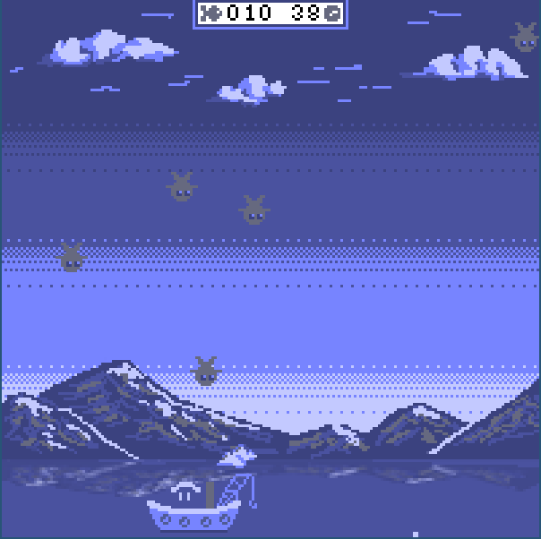
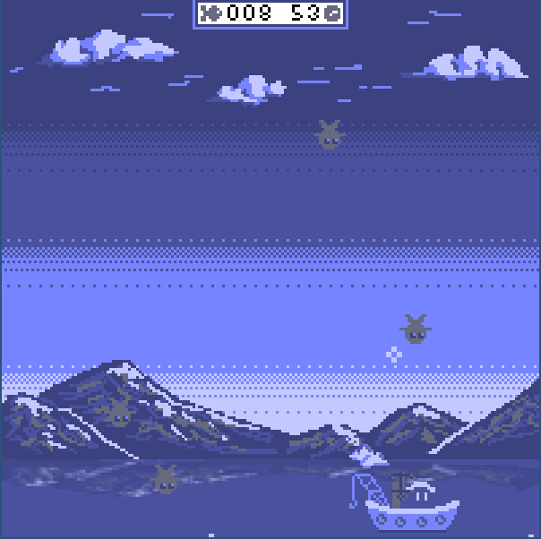
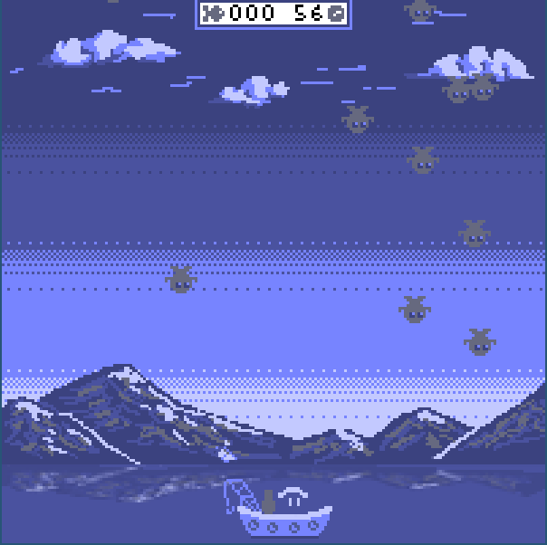

# Fishing time 2D



> Catch as much fishes as you can!

## Description

This is a little 2D game in C made for the learning purpose (OpenGL rendering).
My goal was to make a game in C, the old school way, with as few libs as possible.
It focuses on the engine side.

## Build and run with CMake (Linux only)

> Only Linux is supported (I didn't test on Windows)

- Requires C++11.
- Requires `pragma once` support.
- Requires CMake 2.8.2 or more (tested with 3.10).
- Requires Jam build system to compile FreeType (<https://www.freetype.org/jam/index.html>)
- Use `-DENGINE_ENABLE_LOG` to activate logs (by default in Debug and Release)
- Use `-DENGINE_ENABLE_ASSERT` to activate asserts (by default in Debug)

```bash
mkdir build
cd build
cmake ..
make
make rungame

# Or use the build script
./build.sh
```

## Controls

- `Enter` to start
- `Esc` to leave
- `R` to restart
- `P` to pause
- `Space` to shoot
- `Arrows` to move

## Technical notes

Since C has a manual memory management (no Garbage Collector), the engine methods follow a naming convention to ensure consistency.
Any methods that allocates memory has its 'free' antonym.

- `create` -> `destroy` (e.g., `createTexture`, `destroyTexture`)
- `init` -> `terminate` (e.g., `initLibA`, `terminateLibA`)
- `load` -> `unload` (e.g., `loadResourceB`, `unloadResourceB`)
- `start` -> `stop` (e.g., `startRendering`, `stopRendering`)
- `new` -> `free` (e.g., `newFileContent`, `freeFileContent` or `free(content)`)

## Screenshots




